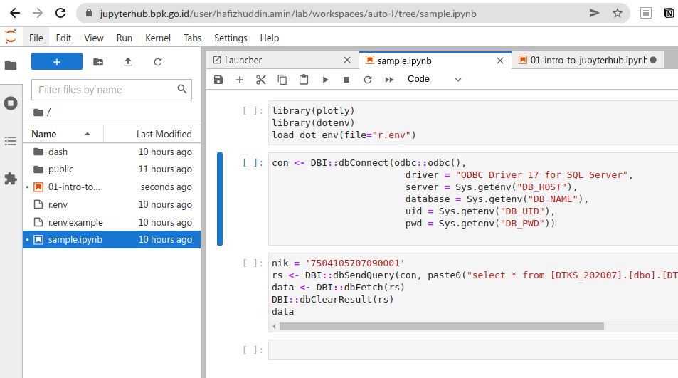
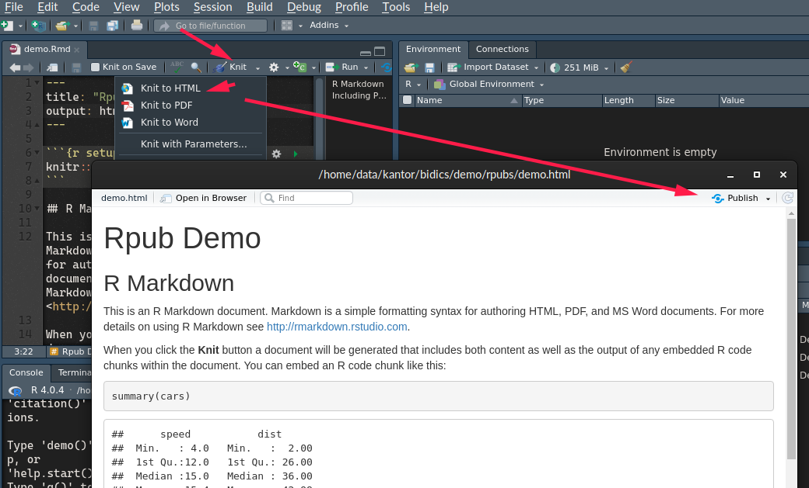
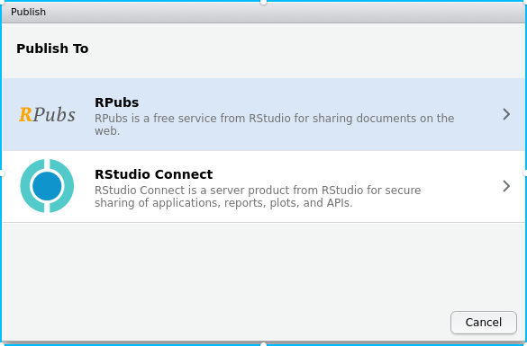
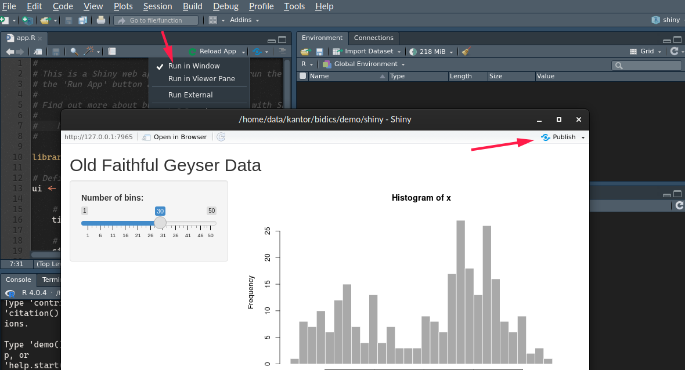
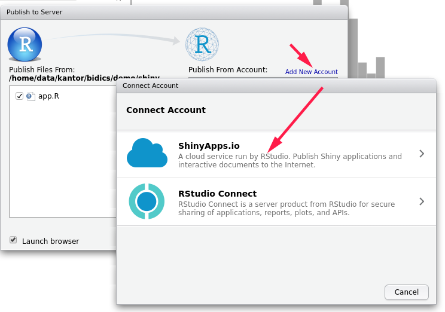

# JupyterHub

## Notebook

Notebook adalah dokumen yang bisa menyatukan kode yang bisa dieksekusi,
visualisasi, dan teks
[Markdown](https://medium.com/analytics-vidhya/the-ultimate-markdown-guide-for-jupyter-notebook-d5e5abf728fd).
Sangat berguna untuk menjelaskan dan memvisualisasikan data. Populer
digunakan dalam [*reproducible
research*](https://arxiv.org/pdf/1810.08055.pdf). Saat ini banyak
didukung oleh aplikasi dan layanan populer:

-   Jupyter Notebook;
-   RStudio;
-   Visual Studio Code; memiliki fitur
    [Notebook](https://code.visualstudio.com/docs/datascience/jupyter-notebooks)
-   GitHub; mis. [Getting Started with Jupyter
    Notebook](https://github.com/Reproducible-Science-Curriculum/introduction-RR-Jupyter/blob/gh-pages/notebooks/getting_started_with_jupyter_notebooks.ipynb)
-   Kaggle; mis. [Movie recommendation system
    notebook](https://www.kaggle.com/codefreaksubhamml/movie-recommendation-system-vectorization-bow)

## Fitur JupyterHub

print(“hello”)

JupyterHub adalah multi-user Jupyter Notebook yang bisa berjalan di
[infrastruktur
sendiri](https://zero-to-jupyterhub.readthedocs.io/en/latest/index.html)
atau di penyedia-awan dan menyediakan lingkungan kerja untuk
mengeksplorasi dan publikasi data untuk user yang tidak ingin repot
dengan rumitnya instalasi lingkungan pemrograman di komputer pribadinya.

Lingkungan tersebut memiliki banyak kelebihan:

TODO: scratch these. dari sisi user aja.

-   **Mudah dikustomisasi**: menyediakan beragam ‘kernel’ (R, Julia,
    Python) dan paketan library bawaan serta bisa diakses dari beragam
    antarmuka (Jupyter Notebook, RStudio, dll)
-   **Fleksibel**: mudah dikustomisasi dan diintegrasikan dengan sistem
    lain
-   **Scalable**: container-based dan berjalan pada infrastruktur
    komputasi terdistribusi; jumlah pengguna yang didukung dapat dengan
    disesuaikan dengan ketersediaan sumberdaya komputasi.

## JupyterHub BPK

JupyterHub BPK tersedia di <https://jupyterhub.bpk.go.id>. Saat ini
sementara dibatasi untuk peserta DAC dan pegawai tertentu.

### Fitur yang tersedia

-   Notebook dan Shell Console
-   Publish aplikasi Shiny
-   Publish aplikasi Dash (python)

### Pembuatan Notebook

Notebook dapat digunakan untuk eksplorasi data dan membuat narasi dari
langkah ekplorasi Anda.

-   Dari launcher, silakan pilih jenis Notebook berdasarkan kernel yang
    didukung (R dan Python).
-   Saat ini mendukung akses ke database SQL Server, MySQL, dan SQLite
-   Basis workspace image adalah [Datascience docker
    image](https://jupyter-docker-stacks.readthedocs.io/en/latest/using/selecting.html#jupyter-datascience-notebook)
    dengan tambahan library yang umum digunakan di
    <https://dashboard.bpk.go.id>.
-   Tentukan *framework* yang digunakan; JupyterHub BPK mendukung
    publikasi untuk aplikasi Shiny dan Dash python.

### Berbagi Notebook

Saat ini, JupyterHub BPK belum menyediakan cara yang mudah untuk berbagi
dengan user lain. Sementara ini gunakan fitur `Download`.

## R dan RStudio

Lorem ipsum

# Publikasi

## JupyterHub

Setelah eksplorasi, saatnya mempublikasikan karya Anda agar bisa dilihat
dan digunakan oleh pegawai BPK lainnya.

### R

Untuk kode R/Shiny, buat folder `public` di root folder. Anda bisa
mempublikasikan dalam bentuk artikel (RMarkdown) atau App.

-   Artikel: buat/unggah berkas RMarkdown, atau copy-paste notebook anda
    ke dalam file dengan ekstensi Rmd, dengan tambahan header khusus.
-   App: pastikan ada `app.R` dengan kode yang memanggil `shinyApp()`

RMarkdown/Shiny akan tersedia di
<https://dashboard.bpk.go.id/NAMA-AKUN-BPK>, mis.
<https://dashboard.bpk.go.id/pingky>.

### Python

JupyterHub BPK mendukung publikasi python yang menggunakan
[Dash](https://plotly.com/dash/). Caranya, buat folder `dash` dan unggah
aplikasi Anda di folder tersebut.Aplikasi akan tersedia di
<https://NAMA-AKUN-BPK.dac.dashboard.bpk.go.id>, mis.
<https://hafizhuddin-amin.dac.dashboard.bpk.go.id>

Selain di atas, Notebook dapat anda unduh dan diunggah ulang mis. di
repositori publik Anda di GitHub untuk di-render di sana, atau diekspor
sebagai PDF, HTML, dan Slide; keduanya lewat menu `File > Download` atau
`File > Save and Export Notebook As`.

## RPubs

Layanan publikasi [RPubs](https://rpubs.com/) terintegrasi dengan
RStudio. Untuk mempublish tulisan kita, cukup dengan mengikuti langkah
berikut:

-   Registrasi di RPubs lalu login

-   Buat file RMarkdown di RStudio

-   Klik tombol `Knit to HTML` yang ada di toolbar lalu klik Publish di
    jendela yang muncul

    

-   Pilih RPubs

    

## Shinyapps.io

Sama dengan RPubs, Shinyapps.io terintegrasi dengan RStudio.

-   Registrasi dan login di <https://shinyapps.io>
-   Buka project di RStudio
-   Klik tombol Run App di viewer, klik tombol Publish, lalu pilih
    ShinyApps

-   Ikuti petunjuk yang diberikan untuk menghubungkan ShinyApps dan
    RStudio
